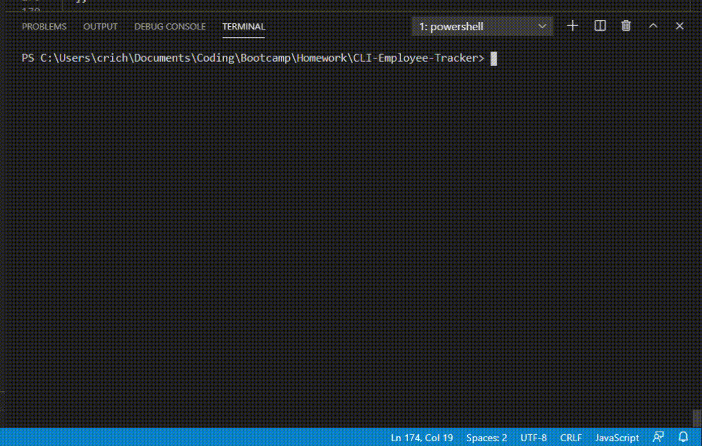

# Employee Tracker
    
## Description  
  Allows the user to view, add, delete, and modify employee data   

## Usage  
<ol>
<li>Clone the repository and install with <i>npm i</i></li>
<li>Once the application starts, use the arrow keys to select an Action from the available optins in the terminal</li>
<li>To add an Employee, Department, or Role, provide the data via the terminal prompts</li>
<li>To update an employee's Role, provide the Employee ID you would like to modify, along with the Role ID you would like to assign to the employee</li>
</ol>

## Demo

## Questions  
My GitHub profile: [crichards17](https://github/crichards17)  
My email: [crichards1717@gmail.com](crichards1717@gmail.com)  